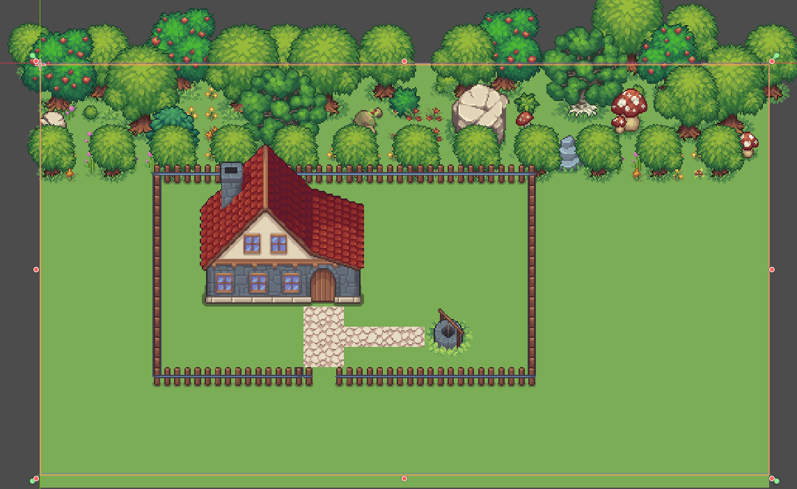
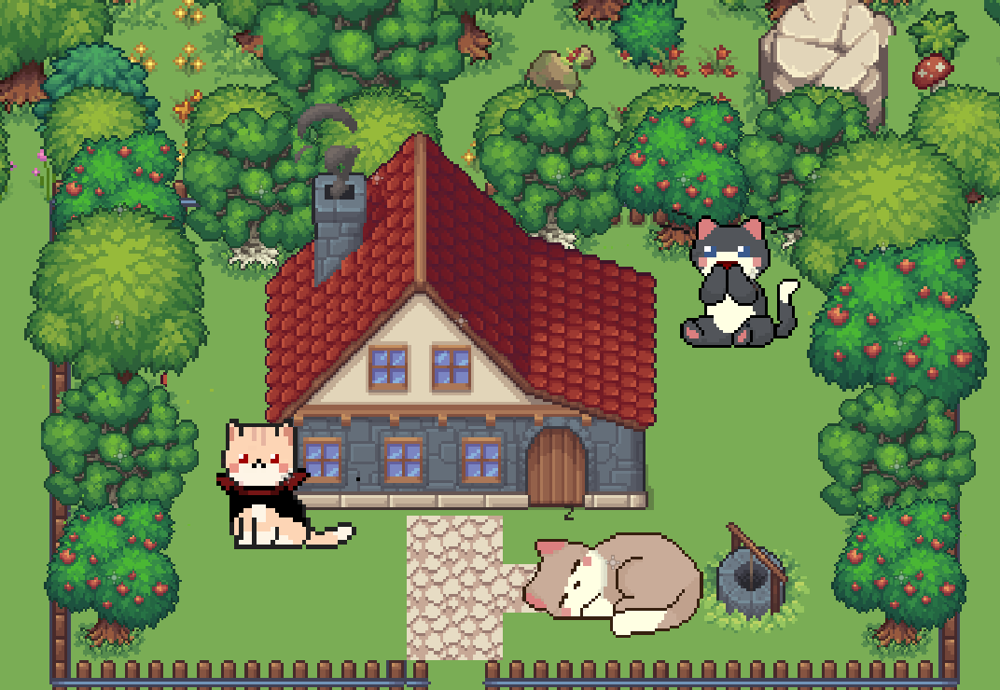
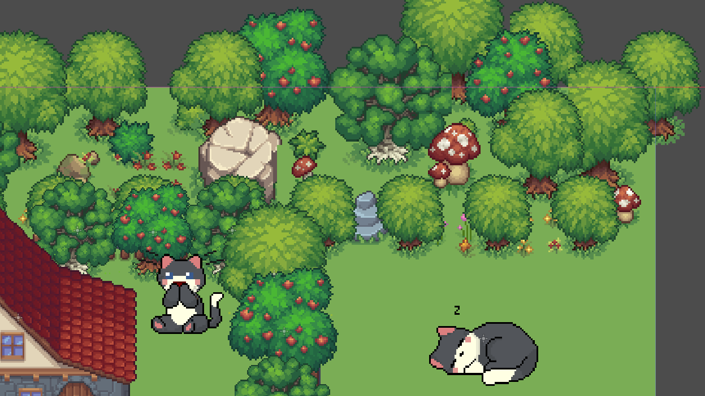

# Meow_GodotGame 🐈

A small Godot project about creating a place for giant cats.

## About

This is an early prototype built using free assets from itch.io and a few cat animations. The goal is to create a simple, relaxing scene where players can explore, meet giant cats, and interact with them.

## Current Features

- Outdoor Forest
- Interactive house
- Basic interactions with Cats

  <!-- 🐸 MAIN ANIMATION -->
  
  
  
  

## Status

🚧 Work in Progress

This project is mainly a learning project and its scope may change as development continues.

## Credits

This project uses free assets from itch.io. Special thanks to the creators for making their work available.

* **Main Characters Home (Free Top-Down Pixel Art Asset)** by **Free Game Assets (GUI, Sprite, Tilesets)**
  https://free-game-assets.itch.io/main-characters-home-free-top-down-pixel-art-asset

* **Cat Pack (Mochi)** by **ToffeeCraft**
  https://toffeecraft.itch.io/cat-pack

* **Cat Retro** by **ToffeeCraft**
  https://toffeecraft.itch.io/cat-retro
